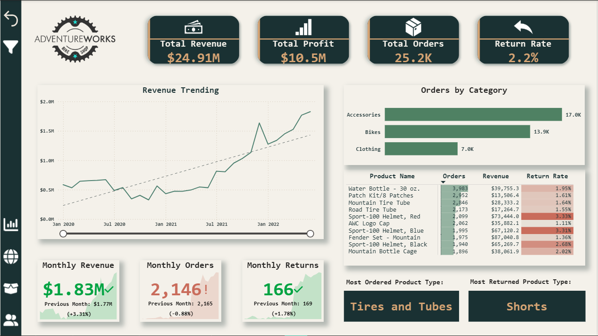
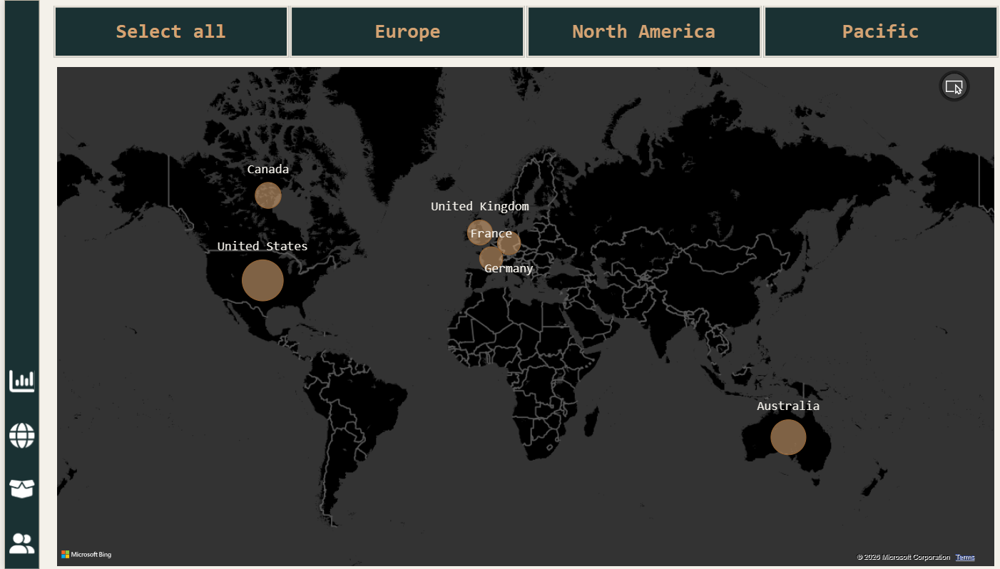
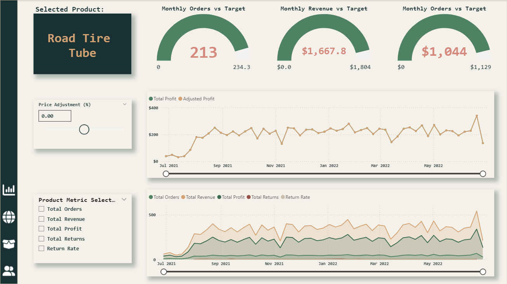
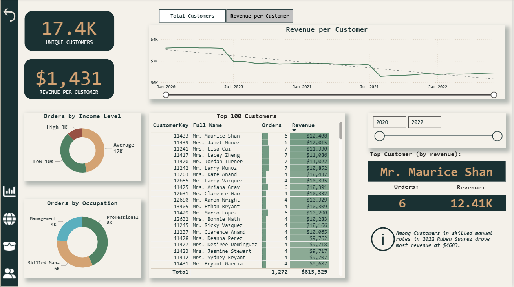
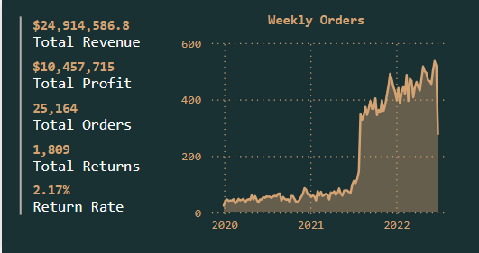
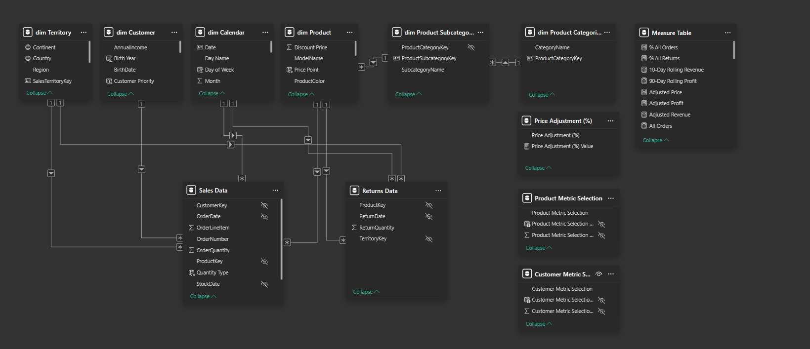
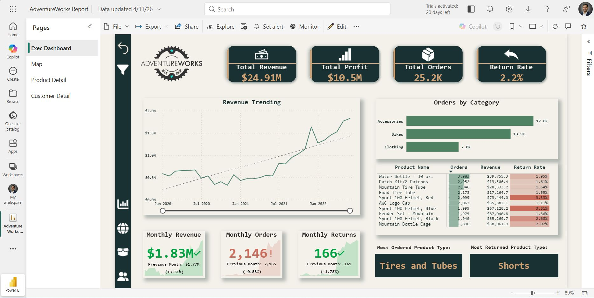

# AdventureWorks Sales & Customer Performance Dashboard

## Project Overview

This project is an end-to-end Power BI dashboard built using the AdventureWorks dataset.

The dashboard was designed to analyze:

* Revenue
* Profit
* Orders
* Return rate
* Product performance
* Customer behavior
* Regional trends

The report was built from raw CSV files through ETL, data modeling, DAX calculations, dashboard design, and publishing in Power BI Service.

## Business Problem

The business lacked a centralized reporting solution to monitor sales performance, customer trends, return rates, and regional performance across multiple markets.

## Live Dashboard Link

https://app.powerbi.com/reportEmbed?reportId=c7a2f72e-8d31-418f-8fb5-aea0ec51d083&autoAuth=true&ctid=5a5a621b-e176-447e-b350-ef841e420c25

## Dashboard Pages

* Executive Dashboard
* Geographic Analysis
* Product Detail
* Customer Detail
* Custom Tooltip Page

## Key Insights

* Accessories generated the highest order volume with approximately 17K orders, outperforming Bikes and Clothing categories.
* Tires and Tubes emerged as the most ordered product type, indicating consistently strong demand across product lines.
* Shorts recorded the highest return rate among product categories, highlighting a potential quality or customer satisfaction issue.
* Total revenue increased from roughly $0.5M monthly in early 2020 to nearly $1.8M by 2022, showing strong long-term business growth.
* Revenue per customer declined over time despite total order growth, suggesting that order frequency increased faster than average customer value.
* The United States generated the largest share of regional sales, making it the strongest-performing market in the dashboard.

## Tools Used

* Power BI Desktop
* Power Query
* DAX
* Power BI Service
* CSV Data Sources

## Technical Skills Demonstrated

* ETL and data cleaning
* Star schema modeling
* Fact and dimension tables
* DAX measures
* Time intelligence
* Drillthrough
* Bookmarks
* Custom tooltips
* Conditional formatting
* What-if analysis
* Field parameters
* Row-level security
* Dashboard storytelling

## Dashboard Screenshots

### Executive Dashboard

### Map Page

### Product Detail Dashboard

### Customer Detail Dashboard

### Tooltip Page

### Data Model

### Power BI Service Upload

## Dataset Files

- [Calendar Lookup](dataset/Calendar%20Lookup.csv)
- [Customer Lookup](dataset/Customer%20Lookup.csv)
- [Product Categories Lookup](dataset/Product%20Categories%20Lookup.csv)
- [Product Lookup](dataset/Product%20Lookup.csv)
- [Product Subcategories Lookup](dataset/Product%20Subcategories%20Lookup.csv)
- [Returns Data](dataset/Returns%20Data.csv)
- [Sales Data 2020](dataset/Sales%20Data%202020.csv)
- [Sales Data 2021](dataset/Sales%20Data%202021.csv)
- [Sales Data 2022](dataset/Sales%20Data%202022.csv)
- [Territory Lookup](dataset/Territory%20Lookup.csv)

